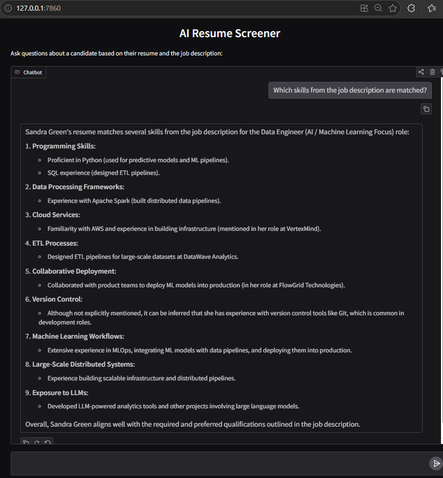

# AI Resume Screener

An AI-powered recruiter assistant that analyzes a candidate’s resume to a job description and answers screening questions using LLMs.

---

## Features

- Load candidate resume (PDF / LinkedIn export)
- Analyze with job description
- Ask recruiter-style questions such as skills or fit score
- Interactive chat UI using Gradio

---

## How It Works

1. Extract text from resume PDF  
2. Load job description from `.txt` file  
3. Combine both into a structured prompt  
4. Send user questions + context to LLM  
5. Return intelligent screening responses  


---

## Installation & Setup

### 1. Install dependencies

```bash
pip install -r requirements.txt
```

## Project Structure

```
AI_RESUME_SCREENER/
│
├── resume_screen.py      
├── requirements.txt      
├── .env                 
│
├── Data/
│   ├── job_description.txt
│   └── Resume_SandraGreen.pdf

```

---

## Installation & Setup

### Install dependencies

```bash
pip install -r requirements.txt
```

---


## How to get an OpenAI API Key

To use this project, you’ll need an OpenAI API key.

1. Go to the OpenAI platform:  
   https://platform.openai.com/

2. Sign up or log in to your account

3. Navigate to the API keys page:  
   https://platform.openai.com/api-keys

4. Click **"Create new secret key"**

5. Copy the key and store it securely

---

## Add API Key to Your Project

Create a `.env` file in the root directory and add:

```env
OPENAI_API_KEY=your_api_key_here
```

## Run the App

```bash
python resume_screen.py
```

##  Then open:

```bash
http://127.0.0.1:7860
```

## Demo




## Example Questions

- Is this candidate a good fit for the role?
- Which skills from the job description are matched?
- What are the candidate’s key strengths?
- Give a fit score from 1 to 100
- Summarize this candidate
- What technical questions are appropriate for this candidate?
- Is this candidate overqualified or underqualified?

## Tech Stack

- Python  
- OpenAI API (LLM)  
- Gradio (UI)  
- PyPDF (PDF parsing)  
- python-dotenv (environment variables)  

